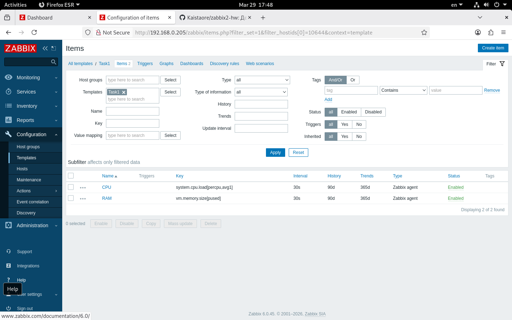
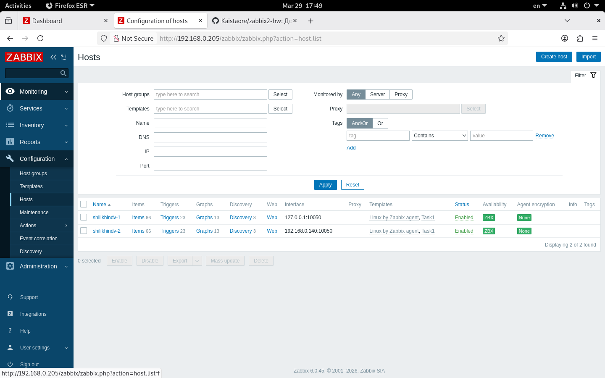
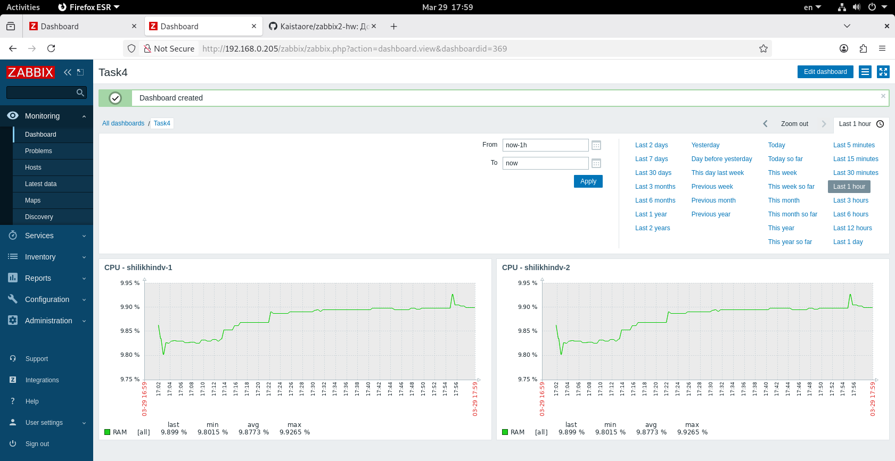

# Домашнее задание "Система мониторинга Zabbix. Часть 2"

## Описание
В рамках домашнего задания был создан шаблон для мониторинга CPU и RAM, добавлены два хоста с Zabbix Agent, создан кастомный дашборд.

## Выполненные задания

### Задание 1
Создан шаблон `Task1` с элементами данных:
- **CPU** (key: `system.cpu.load[percpu,avg1]`)
- **RAM** (key: `vm.memory.size[pused]`)

### Задание 2-3
Добавлены два хоста:
- `shilikhindv-1` (IP: 127.0.0.1)
- `shilikhindv-2` (IP: 192.168.0.140)

Привязанные шаблоны:
- `Linux by Zabbix agent`
- `Task1`

Статус: **ZBX (зелёный)**

### Задание 4
Создан дашборд **"CPU and RAM Dashboard"** с графиками CPU и RAM.

